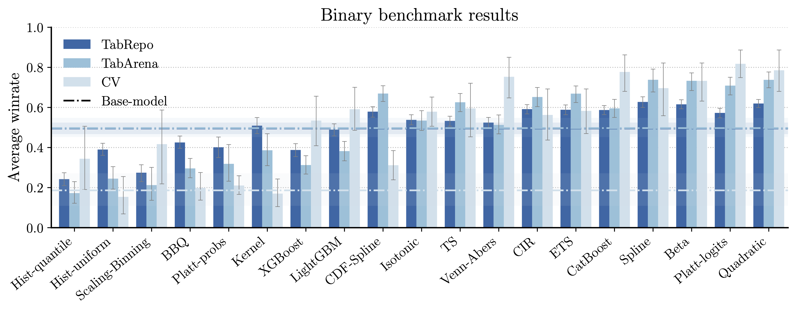
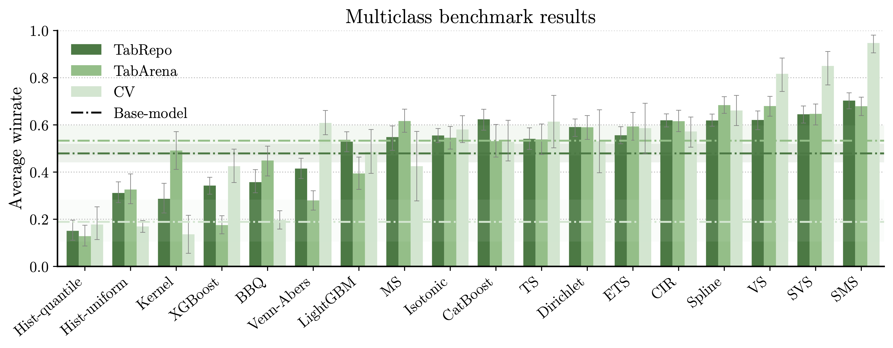

# CalArena

**A large-scale benchmark for post-hoc calibration of classification models.**

CalArena systematically evaluates 20 binary and 19 multiclass calibration methods across
hundreds of (dataset, model) pairs spanning classical tabular models, state-of-the-art
tabular foundation models, and computer vision networks. All calibrator implementations
are provided by the [probmetrics](https://github.com/probkit/probmetrics) package.


## Leaderboards

**Binary Calibration Winrates**


**Multiclass Calibration Winrates**


Above, we plot results for binary and multiclass post-hoc calibration benchmarks.
Each bar represents the winrate of the calibration method, averaged over all experiments
in the benchmark with 95% Confidence Intervals (CIs) constructed by bootstrapping entire
datasets (TabRepo and TabArena-binary benchmarks) or experiments directly
(TabArena-multiclass and CV benchmarks).
Methods are ranked based on the average winrate over the three benchmarks.


## Repository structure

```
CalArena/
├── run_benchmark.py              # Run calibration experiments
├── utils.py                      # Analysis utilities and plotting helpers
├── custom_calibrators.py         # Register your own calibrators
├── paper_figures.ipynb           # Reproduce all paper figures
├── calibration_benchmarks/       # Benchmark data and generation scripts
│   ├── generate_tabrepo_benchmarks.py
│   ├── generate_tabarena_benchmarks.py
│   ├── generate_cv_benchmarks.py
│   ├── cv-binary-experiments.csv             # CV dataset/model index (binary)
│   ├── cv-multiclass-experiments.csv         # CV dataset/model index (multiclass)
│   └── imagenet-multiclass-experiments.csv.  # ImageNet model index
├── batch_scripts/                # SLURM job scripts for cluster execution
├── results/                      # Benchmark results (one CSV per calibrator)
│   └── {benchmark}/{calibrator}.csv
└── figures/                      # Paper figures (PDF)
```

> **Note:** The generated HDF5 files (`calibration_benchmarks/*.h5`) are listed in `.gitignore` due to their size (up to ~1.4 GB for ImageNet).
> Download them from [HuggingFace](https://huggingface.co/datasets/probkit/CalArena).
> You can also run the generation scripts once to produce them locally; see below.


## Benchmarks

CalArena includes **7 benchmarks** across three data modalities:

| Benchmark | Modality | Base models | Datasets |
|---|---|---|---|
| `tabrepo-binary` | Binary | 8 classical tabular models | 104 tabular datasets |
| `tabrepo-multiclass` | Multiclass | 8 classical tabular models | 65 tabular datasets |
| `tabarena-binary` | Binary | 11 modern tabular models | 30 tabular datasets |
| `tabarena-multiclass` | Multiclass | 11 modern tabular models | 8 tabular datasets |
| `cv-binary` | Binary | 9 CV models | CIFAR-10 (Animal vs Machine), Breast, Pneumonia |
| `cv-multiclass` | Multiclass | 10 CV models | CIFAR-10/100, Birds, SVHN, Derma, OCT |
| `imagenet-multiclass` | Multiclass (1000 classes) | 8 CV models | ImageNet |

Each benchmark is stored as a single HDF5 file (`calibration_benchmarks/{benchmark}.h5`) with the hierarchy `{dataset}/{model}/` → `{probas_cal, labels_cal, probas_test, labels_test}`, plus a companion `{benchmark}-experiments.csv` listing dataset, model, calibration size, test size, and number of classes.

**TabRepo** base models: CatBoost, ExtraTrees, LightGBM, LinearModel, NeuralNetFastAI, NeuralNetTorch, RandomForest, XGBoost.

**TabArena** base models (≥ 1300 ELO on [TabArena leaderboard](https://huggingface.co/spaces/TabArena/leaderboard), as of April 1 2026): TabPFN-v2.6, TabICLv2, RealTabPFN-v2.5, TabICL\_GPU, LimiX\_GPU, TabM\_GPU, RealMLP\_GPU, BetaTabPFN\_GPU, ModernNCA\_GPU, Mitra\_GPU, TabDPT\_GPU.


## Calibrators

### Binary (20 methods)

| Name | Method |
|---|---|
| `Base-model` | No calibration (raw model probabilities) |
| `Hist-uniform` | Histogram binning — uniform bins |
| `Hist-quantile` | Histogram binning — quantile bins |
| `Scaling-Binning` | Platt scaling + histogram binning |
| `BBQ` | Bayesian Binning into Quantiles |
| `Isotonic` | Isotonic regression |
| `CIR` | Centered Isotonic Regression |
| `Venn-Abers` | Venn-Abers predictor |
| `TS` | Temperature Scaling |
| `ETS` | Ensemble Temperature Scaling |
| `Platt-probs` | Platt Scaling on top-class probabilities |
| `Platt-logits` | Platt Scaling on top-class logits |
| `Quadratic` | Quadratic logistic calibration |
| `Beta` | Beta calibration |
| `Spline` | MLI Spline |
| `CDF-Spline` | Gupta Spline |
| `Kernel` | Kernel calibration |
| `XGBoost` | XGBoost calibrator |
| `LightGBM` | LightGBM calibrator |
| `CatBoost` | CatBoost calibrator |

### Multiclass (19 methods)

| Name | Method |
|---|---|
| `Base-model` | No calibration |
| `Hist-uniform` | Histogram binning — uniform bins (OvR) |
| `Hist-quantile` | Histogram binning — quantile bins (OvR) |
| `Isotonic` | Isotonic regression (OvR) |
| `CIR` | Centered Isotonic Regression (OvR) |
| `Venn-Abers` | Venn-Abers predictor (OvR) |
| `BBQ` | Bayesian Binning into Quantiles (OvR) |
| `Spline` | MLI Spline (OvR) |
| `TS` | Temperature Scaling |
| `ETS` | Ensemble Temperature Scaling |
| `VS` | Vector Scaling |
| `SVS` | Scalar Vector Scaling |
| `MS` | Matrix Scaling |
| `SMS` | Scalar Matrix Scaling |
| `Dirichlet` | Dirichlet calibration |
| `Kernel` | Kernel calibration |
| `XGBoost` | XGBoost calibrator |
| `LightGBM` | LightGBM calibrator |
| `CatBoost` | CatBoost calibrator |


## Metrics

- **Binary**: log-loss, Brier score, accuracy, ECE-15, Kuiper
- **Multiclass**: log-loss, Brier score, accuracy, ECE-15


## Installation

Every post-hoc calibrator benchmarked is available in the [probmetrics](https://github.com/probkit/probmetrics) python package.

To run the benchmark, you need to install probmetrics with extra dependencies:

```bash
# "extra" and "dirichletcal" install other calibration package to support all
# calibrators in the library.
pip install 'probmetrics[extra,dirichletcal]'

# To load the benchmark data, you also need h5py
pip install h5py
```

For results analysis and plotting you need extra packages
```bash
pip install scikit-posthocs # Statistical analysis and CD diagrams
pip install arena-rank # To compute Elo scores
```


## Downloading or generating the benchmarks

### Downloading (recommended)

The pre-generated benchmark files (HDF5 + experiment CSVs) are available on HuggingFace:

> **[https://huggingface.co/datasets/probkit/CalArena](https://huggingface.co/datasets/probkit/CalArena)**

Download the files and place them under `calibration_benchmarks/`.

### Generating the benchmarks from the original data sources

For the sake of completeness, we provide the scripts that we ran to generate the benchmarks from the original data sources.

**We strongly recommend using the files downloaded from HuggingFace as accessing model predictions from TabRepo and TabArena requires downloading hundred gigabytes of raw data locally.**

Each script writes its output directly into `calibration_benchmarks/`, you only need to run these once.

```bash
python calibration_benchmarks/generate_tabrepo_benchmarks.py # requires installing tabrepo
python calibration_benchmarks/generate_tabarena_benchmarks.py # requires installing tabarena
python calibration_benchmarks/generate_cv_benchmarks.py # requires downloading the data from original sources
```

**TabRepo note:** Model predictions (we use context `D244_F3_C1530_200`, ~120 GB total) are downloaded automatically on first run. Ensure a fast internet connection.

**TabArena note:** Model predictions (~60 GB total) are downloaded automatically on first run. Ensure a fast internet connection.

**CV data note:** `generate_cv_benchmarks.py` reads raw logits from `cv_data/` (gitignored). Place the Markus pickle files under `cv_data/Markus/` and the Hekler safetensors files under `cv_data/Hekler/` before running. The experiment-list CSVs (`cv-binary-experiments.csv`, etc.) are already committed and serve as the index of which datasets and models to process.


## Running the benchmarks

Once the HDF5 and CSV files are downloaded and stored under `calibration_benchmarks/`, you can run the benchmarks using the following python scripts.

### Run all calibrators

```bash
python run_benchmark.py --benchmark tabrepo-binary
```

Results are saved to `results/{benchmark}/{calibrator}.csv` — one file per calibrator.

### Run a single calibrator

```bash
python run_benchmark.py --benchmark tabrepo-binary --calibrator TS
```

Results are saved to `results/{benchmark}/{calibrator}.csv`.

### CLI reference

```
--benchmark       Name of the benchmark, e.g. tabrepo-binary, cv-multiclass   [required]
--calibrator      Name of a single calibrator to run (default: run all)
--benchmarks_dir  Directory containing benchmark HDF5/CSV files (default: calibration_benchmarks)
--results_dir     Directory to write results (default: results)
```


## Cluster execution (SLURM)

The recommended cluster strategy is to submit one job per calibrator so that runtimes are isolated. Ready-to-use SLURM scripts for each benchmark are in `batch_scripts/`. Before submitting, uncomment and adjust the `conda activate` line for your environment:

```bash
sbatch batch_scripts/tabrepo-binary.batch
```

Example script (abbreviated):

```bash
#!/bin/bash
#SBATCH --array=0-19
#SBATCH --cpus-per-task=1
#SBATCH --mem=16G
#SBATCH --time=05:00:00
#SBATCH --output=logs/%x_%A_%a.out

CALIBRATORS=(
  "Base-model"
  "Hist-uniform" "Hist-quantile" "Scaling-Binning" "BBQ"
  "Isotonic" "CIR" "Venn-Abers"
  "TS" "ETS" "Platt" "Affine" "Quadratic" "Beta"
  "Spline" "CDF-Spline" "Kernel"
  "XGBoost" "LightGBM" "CatBoost"
)

cd $HOME/CalArena

python run_benchmark.py \
    --benchmark tabrepo-binary \
    --calibrator "${CALIBRATORS[$SLURM_ARRAY_TASK_ID]}"
```

SLURM output logs are written to `logs/` (gitignored).


## Adding your own calibrator

### Step 1 — Implement the calibrator

A calibrator must expose two methods:

```python
def fit(self, p_cal: np.ndarray, y_cal: np.ndarray) -> None: ...
def predict_proba(self, p_test: np.ndarray) -> np.ndarray: ...
```

For binary tasks, `p_cal` / `p_test` are 1-D arrays of positive-class probabilities (or shape `(n, 2)`). For multiclass tasks they are `(n, k)` arrays.

The cleanest approach is to subclass the `probmetrics` base class, which accepts either a NumPy or PyTorch implementation:

```python
from probmetrics.calibrators import Calibrator

class MyCalibrator(Calibrator):
    def _fit_impl(self, X: np.ndarray, y: np.ndarray) -> None:
        '''Implement either this or the following'''
        ...

    def _fit_torch_impl(
        self, y_pred: CategoricalDistribution, y_true_labels: torch.Tensor
    ) -> None:
        '''Implement either this or the previous'''
        ...
    
    def _predict_proba_impl(self, X: np.ndarray) -> np.ndarray:
        '''Implement either this or the following'''
        ...

    def _predict_proba_torch_impl(
        self, y_pred: CategoricalDistribution
    ) -> CategoricalDistribution:
        '''Implement either this or the previous'''
        ...
```

Any object that satisfies `.fit()` / `.predict_proba()` works — inheriting from `Calibrator` is optional.

### Step 2 — Register it in `custom_calibrators.py`

```python
from my_module import MyCalibrator

CUSTOM_CALIBRATORS = {
    "MyCalibrator": lambda: MyCalibrator(),
}
```

The dictionary key is the **display name** used in plot legends and result filenames.

### Step 3 — Run it

```bash
python run_benchmark.py --benchmark tabrepo-binary --calibrator MyCalibrator
```

Results are saved to `results/tabrepo-binary/MyCalibrator.csv`, exactly like a built-in method.


## Reproducing the paper figures

All figures are generated by [`paper_figures.ipynb`](paper_figures.ipynb). Pre-generated PDFs are in `figures/`.

Results are loaded via `load_benchmark_results()` from [`utils.py`](utils.py):

```python
from utils import load_benchmark_results

df = load_benchmark_results(
    benchmark_name="tabrepo-binary",
    methods=["TS", "Platt", "Isotonic", "Base-model"],
)
```

`utils.py` also provides:
- `compute_winrates()` — mean win rates with 95% bootstrap CIs (dataset-level or experiment-level)
- `compute_elo_scores()` — Bradley-Terry Elo ratings with bootstrap CIs
- `compute_absolute_improvements()` — per-metric improvements over `Base-model`, LaTeX-formatted
- `plot_leaderboard()`, `plot_grouped_leaderboards()`, `plot_cd_diagram()` — reproducing publication figures


## Contributing a calibrator to `probmetrics`

All built-in calibrators live in the [probmetrics](https://github.com/probkit/probmetrics) package. To contribute a new method and include it in the official benchmark, implement it there following the `Calibrator` interface and open a pull request.


## Citation

```bibtex
@inproceedings{calarena2026,
  title     = {CalArena: A Large-Scale Post-Hoc Calibration Benchmark},
  author    = {Eug{\`e}ne Berta and David Holzm{\"u}ller and Francis Bach and Michael I. Jordan},
  booktitle = {preprint},
  year      = {2026},
}
```
